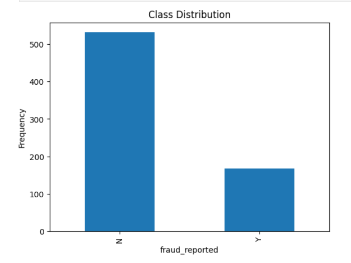
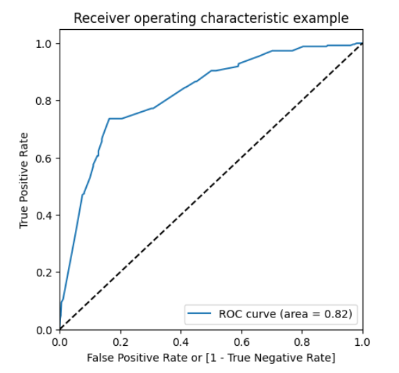

# 🕵️‍♂️ Insurance Fraud Detection 

## 📌 Project Overview

This project focuses on detecting fraudulent insurance claims using machine learning techniques. By analyzing historical claim data, the model identifies patterns and predicts whether a claim is fraudulent or legitimate.

---

## 🎯 Business Objective

* Detect fraudulent claims early
* Reduce financial losses
* Improve operational efficiency
* Speed up legitimate claim processing

---

## 📂 Dataset Description

* Customer details (age, occupation, hobbies)
* Policy information (coverage, premiums)
* Incident details (type, severity, location)
* Claim details (amount, damage type)

👉 Target: **Fraud (Yes / No)**

---

## 🔍 Approach

* Data cleaning
* EDA
* Feature engineering
* Model building
* Model evaluation

---

## 📊 Visualizations

### 📊 Class Distribution

Shows distribution of fraudulent vs non-fraudulent claims.

---

### 📈 Feature Importance

Identifies key variables influencing fraud detection.

---

### 📉 ROC Curve

Indicates strong model performance in distinguishing fraud vs non-fraud.

---

### 📊 Confusion Matrix

Shows model accuracy in predicting correct classes.

---

## 🛠️ Tech Stack

Python, Pandas, NumPy, Scikit-learn

---

## 📈 Model Evaluation

* Accuracy
* Precision
* Recall
* F1 Score
* ROC-AUC

---

## 🎯 Outcome

The model successfully identifies high-risk claims and improves fraud detection efficiency.
